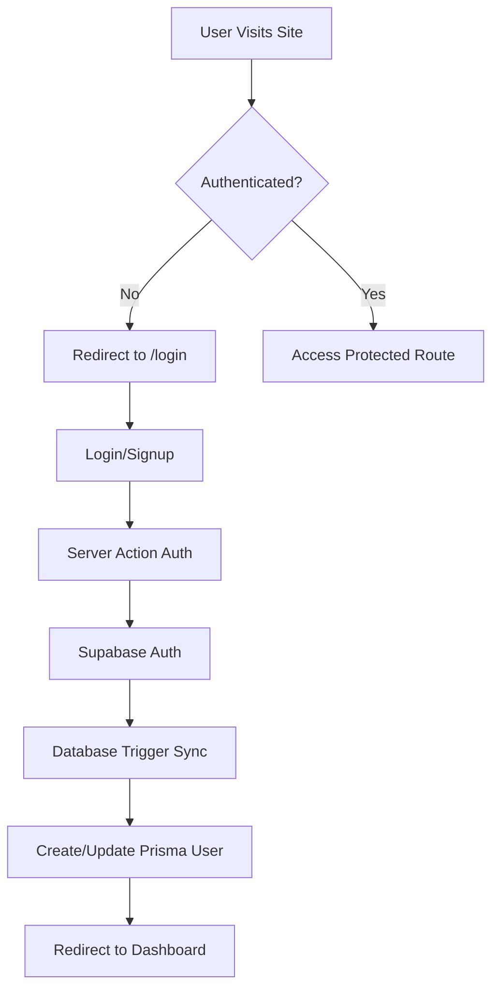

# Authentication System

Complete Supabase authentication implementation for Blue Waters Boat Cruise Booking System using Next.js App Router.

## Architecture

### Client Setup (Next.js App Router Pattern)

We use **@supabase/ssr** for proper Next.js App Router integration with automatic cookie handling:

1. **Browser Client** (`src/lib/supabase/client.ts`) - For Client Components
2. **Server Client** (`src/lib/supabase/server.ts`) - For Server Components & Actions
3. **Middleware Client** (`src/lib/supabase/middleware.ts`) - For session refresh & route protection

### Authentication Flow



## Features

✅ **Server-Side Authentication** - Secure auth in Server Components and Actions  
✅ **Automatic Session Refresh** - Middleware keeps sessions alive  
✅ **Route Protection** - Middleware guards protected routes  
✅ **Database Sync** - Automatic Supabase → Prisma user sync via trigger  
✅ **Email Confirmation** - Optional email verification flow  
✅ **OAuth Ready** - Prepared for OAuth providers (Google, GitHub, etc.)  
✅ **TypeScript** - Full type safety with Supabase types  

## Environment Variables

Add to `.env.local`:

```bash
# Supabase
NEXT_PUBLIC_SUPABASE_URL=https://your-project.supabase.co
NEXT_PUBLIC_SUPABASE_ANON_KEY=your_anon_key_here
SUPABASE_SERVICE_ROLE_KEY=your_service_role_key_here

# Site URL for auth redirects
NEXT_PUBLIC_SITE_URL=http://localhost:3000
```

## Usage Examples

### 1. Client Components (use-auth hook)

```tsx
'use client'

import { useAuth } from '@/src/hooks/use-auth'

export default function MyComponent() {
  const { user, loading, signOut, isAuthenticated } = useAuth()

  if (loading) return <div>Loading...</div>
  
  if (!isAuthenticated) return <div>Please log in</div>

  return (
    <div>
      <p>Welcome, {user?.email}</p>
      <button onClick={signOut}>Sign Out</button>
    </div>
  )
}
```

### 2. Server Components

```tsx
import { createClient } from '@/src/lib/supabase/server'
import { redirect } from 'next/navigation'

export default async function ProtectedPage() {
  const supabase = await createClient()
  
  const { data: { user } } = await supabase.auth.getUser()
  
  if (!user) {
    redirect('/login')
  }

  return <div>Welcome, {user.email}</div>
}
```

### 3. Server Actions

```tsx
'use server'

import { createClient } from '@/src/lib/supabase/server'
import { revalidatePath } from 'next/cache'

export async function updateProfile(formData: FormData) {
  const supabase = await createClient()
  
  const { data: { user } } = await supabase.auth.getUser()
  
  if (!user) throw new Error('Not authenticated')
  
  // Perform action...
  
  revalidatePath('/dashboard')
}
```

## Protected Routes

Routes automatically protected by middleware:

- `/dashboard` - User dashboard
- `/checkout` - Booking checkout
- `/book/*` - Trip booking pages
- `/operator/*` - Operator admin pages

Add more in [`src/lib/supabase/middleware.ts`](src/lib/supabase/middleware.ts):

```typescript
const protectedPaths = ['/dashboard', '/checkout', '/book', '/operator']
```

## Database Synchronization

User data automatically syncs from Supabase Auth → Prisma database via trigger:

**Database Trigger:** `supabase/migrations/xxx_init_bayelsa_boat_cruise_system/migration.sql`

```sql
CREATE OR REPLACE FUNCTION public.sync_user_to_app()
RETURNS TRIGGER AS $$
BEGIN
  INSERT INTO "User" (
    id,
    email,
    "fullName",
    phone,
    role,
    "emailVerified",
    "createdAt",
    "updatedAt"
  ) VALUES (
    NEW.id::text,
    NEW.email,
    COALESCE(NEW.raw_user_meta_data->>'full_name', ''),
    COALESCE(NEW.raw_user_meta_data->>'phone', ''),
    CASE 
      WHEN NEW.raw_user_meta_data->>'user_type' = 'operator' THEN 'OPERATOR'::"UserRole"
      ELSE 'CUSTOMER'::"UserRole"
    END,
    NEW.email_confirmed_at IS NOT NULL,
    NOW(),
    NOW()
  )
  ON CONFLICT (id) DO UPDATE SET
    email = EXCLUDED.email,
    "emailVerified" = EXCLUDED."emailVerified",
    "updatedAt" = NOW();
  RETURN NEW;
END;
$$ LANGUAGE plpgsql SECURITY DEFINER;
```

## API Routes

### Auth Callback Handler

**Route:** `/auth/callback`  
**Purpose:** Handle OAuth callbacks and email confirmations  
**File:** [`src/app/auth/callback/route.ts`](src/app/auth/callback/route.ts)

### Server Actions

**File:** [`src/app/auth/actions.ts`](src/app/auth/actions.ts)

- `login(formData)` - Sign in with email/password
- `signup(formData)` - Create new account
- `signOut()` - End session

## Authentication Pages

### Login Page

**Route:** `/login`  
**File:** [`src/app/login/page.tsx`](src/app/login/page.tsx)

Features:
- Email/password authentication
- Remember me checkbox
- Forgot password link
- Demo credentials display
- Automatic redirect to dashboard on success

### Signup Page

**Route:** `/signup`  
**File:** [`src/app/signup/page.tsx`](src/app/signup/page.tsx)

Features:
- Full name, email, phone, password fields
- User type selection (Customer/Operator)
- Password confirmation
- Terms & conditions checkbox
- Email verification flow
- Automatic database sync via trigger

## Testing Authentication

### 1. Start Development Server

```bash
npm run dev
```

### 2. Create Test Account

1. Visit http://localhost:3000/signup
2. Fill in the form:
   - Full Name: John Doe
   - Email: john@example.com
   - Password: SecurePass123!
   - User Type: Customer
3. Agree to terms
4. Click "Create Account"

### 3. Verify Database Sync

```bash
npx prisma studio
```

Check that user appears in `User` table with correct role.

### 4. Test Login

1. Visit http://localhost:3000/login
2. Enter credentials
3. Should redirect to `/dashboard`

### 5. Test Protected Routes

- Try accessing `/dashboard` without logging in → redirects to `/login`
- Login → can access `/dashboard`
- Logout → redirected to `/login`, can't access `/dashboard`

## Email Configuration

### Development (Console Logs)

By default, Supabase sends confirmation emails to console in development.

### Production Setup

1. Go to Supabase Dashboard → Authentication → Email Templates
2. Configure SMTP or use Supabase's email service
3. Customize email templates:
   - Confirmation email
   - Password reset
   - Magic link

## OAuth Providers (Optional)

To add OAuth providers (Google, GitHub, etc.):

### 1. Enable in Supabase

Dashboard → Authentication → Providers

### 2. Add OAuth Button to Login Page

```tsx
import { createClient } from '@/src/lib/supabase/client'

function LoginWithGoogle() {
  const supabase = createClient()
  
  const handleGoogleLogin = async () => {
    await supabase.auth.signInWithOAuth({
      provider: 'google',
      options: {
        redirectTo: `${process.env.NEXT_PUBLIC_SITE_URL}/auth/callback`
      }
    })
  }
  
  return <button onClick={handleGoogleLogin}>Login with Google</button>
}
```

## Security Best Practices

✅ **Never expose service role key in client code**  
✅ **Use Row Level Security (RLS) in Supabase**  
✅ **Validate inputs in server actions**  
✅ **Use `getUser()` not `getSession()` for auth checks**  
✅ **Enable email confirmation in production**  
✅ **Implement rate limiting for auth endpoints**  
✅ **Use strong password policies**  

## Troubleshooting

### "User not authenticated" errors

- Check middleware is properly configured
- Verify cookies are being set (check browser dev tools)
- Ensure `NEXT_PUBLIC_SITE_URL` is correct

### Redirect loops

- Clear browser cookies
- Check middleware matcher config
- Verify protected paths array

### Database sync not working

- Check trigger exists: `SELECT * FROM pg_trigger WHERE tgname = 'sync_user_trigger';`
- Verify trigger function: `\df sync_user_to_app`
- Check Supabase logs for errors

### Email confirmation not working

- Check Supabase email settings
- Verify callback URL is correct
- Look for emails in spam folder (development)

## Next Steps

- [ ] Add password reset flow
- [ ] Implement email change functionality
- [ ] Add profile update page
- [ ] Set up OAuth providers
- [ ] Add two-factor authentication
- [ ] Implement account deletion
- [ ] Add session management page
- [ ] Set up email notifications

## Resources

- [Supabase Auth Docs](https://supabase.com/docs/guides/auth)
- [Next.js App Router Auth](https://supabase.com/docs/guides/auth/server-side/nextjs)
- [@supabase/ssr Package](https://github.com/supabase/ssr)
- [Prisma with Supabase](https://www.prisma.io/docs/guides/database/supabase)
